# Anamnesis

> A stateful, spec-driven framework for AI-assisted software engineering.

**Version:** 4.3

## Setup Instructions

Copy the entire `anamnesis_starter/` folder to your new project root, then rename it to your project name.

```bash
cp -r anamnesis_starter/ my-new-project/
cd my-new-project/
```

## Structure

```
your-project/
├── anamnesis/                   # The framework (you are here)
│   ├── directives/              # How AI should think and act
│   │   ├── THINKING.md          # First Principles & Design
│   │   └── EXECUTION.md         # Build & Deliver
│   │
│   ├── standards/               # Code quality rules
│   │   ├── INDEX.md             # Which standards to read when
│   │   ├── global.md            # Language-agnostic rules
│   │   ├── python.md            # Python-specific
│   │   └── typescript.md        # TypeScript-specific
│   │
│   ├── templates/               # Frequently recreated files
│   │   ├── active_state.md      # Session state template
│   │   ├── handover.md          # Handover template
│   │   ├── board.md             # Kanban board template
│   │   ├── workstream.md        # Workstream template
│   │   ├── CLAUDE.md            # Claude-specific AGENTS variant
│   │   └── GEMINI.md            # Gemini-specific AGENTS variant
│   │
│   ├── specs/                   # Specification files
│   │   ├── problem.md           # Problem definition
│   │   ├── options.md           # Solution options
│   │   ├── requirements.md      # EARS syntax requirements
│   │   ├── design.md            # Architecture diagrams
│   │   ├── tasks.md             # Atomic task list
│   │   ├── tech.md              # Technical decisions
│   │   └── product.md           # Product definition
│   │
│   ├── .context/                # Project state (living files)
│   │   ├── mission.md           # Living objective
│   │   ├── backlog.md           # Ideas and deferred work
│   │   ├── tech-stack.md        # Approved tools
│   │   ├── board.md             # Kanban board (auto-generated)
│   │   └── workstreams/         # Parallel work contexts
│   │
│   ├── PROJECT_LEARNINGS.md     # Process wisdom
│   ├── DECISION_LOG.md          # Architectural decisions
│   └── README.md                # This file
│
├── AGENTS.md                    # Entry point for AI agents
└── CHANGELOG.md                 # Project version history
```

## Getting Started

1. **Read AGENTS.md** — Entry point that tells AI what to read when
2. **Fill in `.context/mission.md`** — Define your project objective
3. **Start working** — AI will follow the framework automatically

## Documentation

| Document | Purpose |
|----------|---------|
| [Migration Guide](docs/MIGRATION.md) | Upgrade from earlier versions |

## Task Management (v4.3+)

The framework includes enhanced task management with:
- **Dependencies:** Track task relationships and blocking items
- **Status Workflow:** Backlog → Open → In Progress → Blocked → Done → Archive
- **Workstreams:** Organize parallel work contexts for features or investigations
- **Kanban Board:** Visual progress tracking via auto-generated `board.md`

### Task States

| Status | Meaning | Next Action |
|--------|---------|-------------|
| `Backlog` | Idea captured, not prioritized | Prioritize or park |
| `Open` | Ready to work, dependencies met | Start work |
| `In Progress` | Currently being worked on | Complete or block |
| `Blocked` | Cannot proceed, waiting | Resolve blocker |
| `Done` | Verified complete | Archive when ready |
| `Archive` | Historical reference | None |

### User Commands

| Command | Action |
|---------|--------|
| "Generate board" | Regenerate `board.md` from `tasks.md` |
| "Next task" | Find and start next Open task |
| "Switch to [workstream]" | Change active workstream |
| "Archive done tasks" | Move Done tasks to Archive section |

See `anamnesis/specs/tasks.md` for task template and `anamnesis/docs/MIGRATION.md` for upgrading existing projects.

## Key Concepts

- **Directives:** Rules for how AI should think (THINKING.md) and execute (EXECUTION.md)
- **Standards:** Code quality rules organized by language/domain
- **Templates:** Files that get archived and recreated frequently
- **Specs:** Feature specifications (one set per project)
- **.context/:** Living project state that evolves over time

## 📝 How to Use Specs (Spec-Driven Development)

Specs are living documents that serve as the "Source of Truth". You do not need to write them manually; the AI helps you draft them.

### The Lifecycle
1.  **Define (`problem.md`):** You explain the goal. AI drafts the problem statement, user persona, and success metrics.
2.  **Explore (`options.md`):** AI proposes 2-3 technical approaches. You choose one.
3.  **Specify (`requirements.md`):** AI converts the choice into "When... Then..." rules.
4.  **Plan (`tasks.md`):** AI breaks it down into atomic, checklist-style tasks.
5.  **Execute:** AI implements tasks one by one, checking them off.

### User Responsibility
*   **Mission:** You must fill in `.context/mission.md` manually at the start.
*   **Approval:** You must review and approve spec changes before the AI builds.

---

## 🔄 Interaction Diagram

```mermaid
sequenceDiagram
    participant User
    participant AI as AI Agent
    participant Context as .context/
    participant Specs as anamnesis/specs/

    User->>AI: Request

    rect rgb(40, 40, 40)
    Note right of AI: CONTEXT
    AI->>Context: Load state & constraints
    end

    alt Simple Task
        AI->>User: Answer (Escape Hatch)
    else Complex Task
        rect rgb(60, 30, 70)
        Note right of AI: THINKING
        AI->>AI: First Principles & Elimination Test
        AI->>Specs: Draft problem.md, options.md
        AI->>User: 🛑 Consensus Gate - WAIT
        end
        
        User->>AI: Approved

        rect rgb(30, 50, 80)
        Note right of AI: EXECUTION
        loop Task by Task
            AI->>Specs: Read → Build → Test → Mark Done
            opt 3+ Failures
                AI-->>AI: OODA Stop-Gap (may return to Thinking)
            end
        end
        end

        rect rgb(30, 70, 40)
        Note right of AI: EPILOGUE (Reflect)
        AI->>AI: T-RFL: Synthesize learnings
        AI->>Context: Archive state, handover
        AI->>User: Session complete
        end
    end
```



---

## ⚡ Pro-Tips for the User

- **The "Escape Hatch":** If you just want to ask "How do I list files?", the AI knows to skip the heavy process. Just ask.
- **The "Consensus Gate":** The AI will **STOP** after planning. You must explicitly say "Proceed" or "Approved" to start coding.
- **The "Handshake Rule":** The AI is forbidden from planning and executing in the same response. It MUST stop and wait for your go-ahead.
- **The "Epilogue":** If the AI says "I'm done" but hasn't updated the docs, just type: **"Execute Epilogue."**
- **Debug Loop:** If the AI gets stuck, it will enter into **OODA Loop** (Observe, Orient, Decide, Act). It will ask you to run commands to gather evidence. **Run them.**
- **Root File Customization:** The `AGENTS.md` file should be customized for each project. Fill in your tech stack, common commands, and key constraints.