# Visual Guide to Anamnesis Framework

> **Purpose:** Visual reference for humans to understand framework flows and relationships.
> **Note:** This file is NOT loaded by AI. It contains diagrams for human understanding only.

---

## Framework Overview


---

## Thinking Phase Flow


---

## Execution Phase Flow


---

## Task State Machine


---

## Session Lifecycle

```mermaid
sequenceDiagram
    participant User
    participant AI as AI Agent
    participant Context as .context/
    participant Specs as anamnesis/specs/
    participant Directives as directives/

    User->>AI: Request

    rect rgb(40, 40, 40)
    Note right of AI: CONTEXT (Phase 0)
    AI->>Context: Load mission & handover
    AI->>Directives: Read THINKING.md
    end

    alt Complex Task
        rect rgb(60, 30, 70)
        Note right of AI: THINKING (Phases T1-T4)
        AI->>AI: First Principles decomposition
        AI->>Specs: Draft problem.md, options.md
        AI->>User: 🛑 Consensus Gate - WAIT
        end
        
        User->>AI: Approved

        rect rgb(30, 50, 80)
        Note right of AI: EXECUTION (Phases 0-4)
        AI->>Directives: Read EXECUTION.md
        loop Task by Task
            AI->>Specs: Read → Build → Test → Mark Done
            opt 3+ Failures
                AI-->>AI: OODA Loop
            end
        end
        end

        rect rgb(30, 70, 40)
        Note right of AI: EPILOGUE (Phase 4)
        AI->>AI: T-RFL: Synthesize learnings
        AI->>Context: Archive state, update handover
        AI->>User: Session complete
        end
    else Simple Task
        AI->>User: Answer (Escape Hatch)
    end
```



---

## File Relationships


---

## Consensus Gate Handshake

```mermaid
sequenceDiagram
    participant AI as AI Agent
    participant User
    
    rect rgb(60, 30, 70)
    Note right of AI: PLANNING COMPLETE
    AI->>AI: Generated plan and specs
    AI->>User: Present summary with:
        - Problem definition
        - Options considered
        - Recommended approach
        - Trade-offs accepted
    AI->>User: "Does this framing match your understanding?"
    AI->>User: "Should we proceed with this approach?"
    Note right of AI: 🛑 MANDATORY STOP
    end
    
    User->>AI: "Approved" / "Proceed" / "Go"
    
    rect rgb(30, 50, 80)
    Note right of AI: EXECUTION PHASE
    AI->>AI: Begin implementation
    end
```

---

## OODA Debugging Loop


---

## Workstream & Dependency Management


---

## How to Use This Guide

1. **Framework Overview** - Understand all components and their relationships
2. **Phase Flows** - See detailed flow of THINKING and EXECUTION phases
3. **Task State Machine** - Understand task lifecycle and valid transitions
4. **Session Lifecycle** - See complete interaction from request to completion
5. **File Relationships** - Understand how different files connect and influence each other
6. **Specific Patterns** - Deep dive into Consensus Gate, OODA Loop, and Workstream management

For detailed instructions, see the directive files:
- `directives/THINKING.md` - First principles and design thinking
- `directives/EXECUTION.md` - Build, test, and delivery protocols